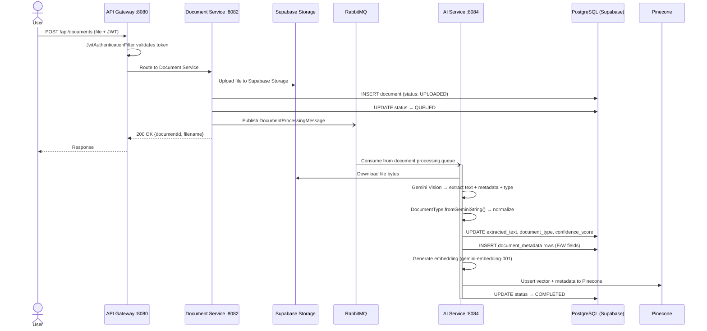
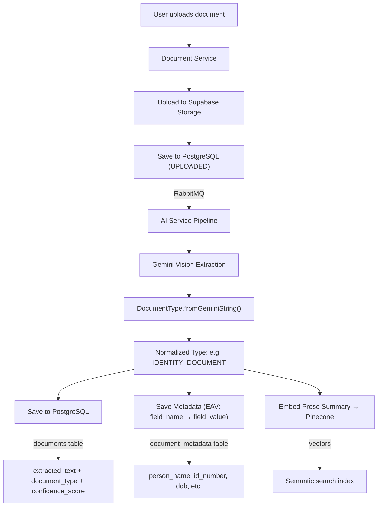
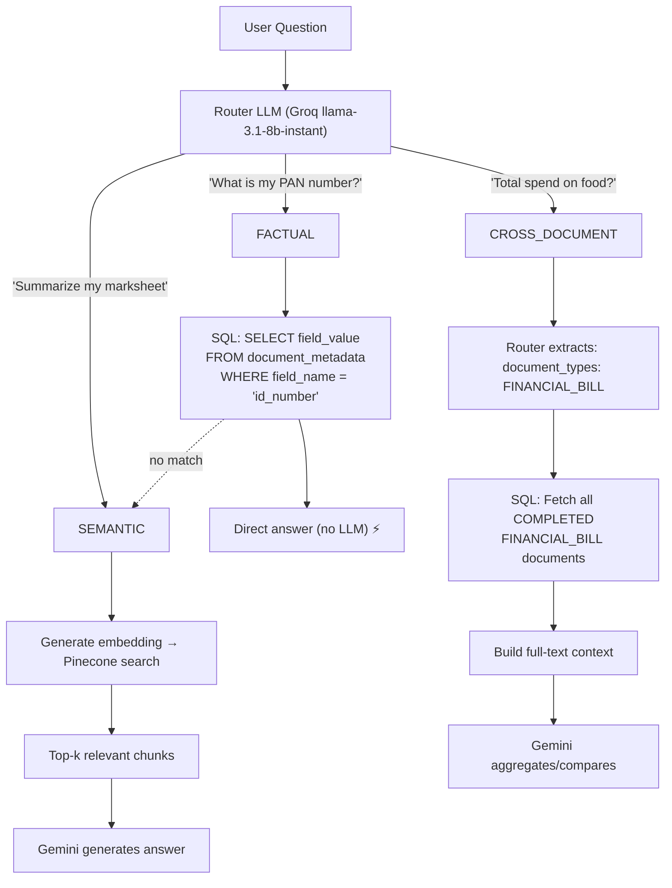
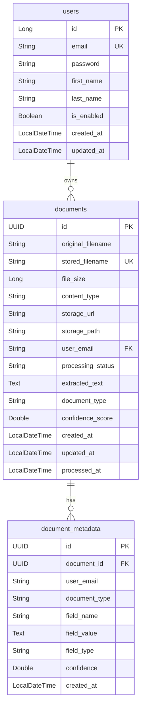
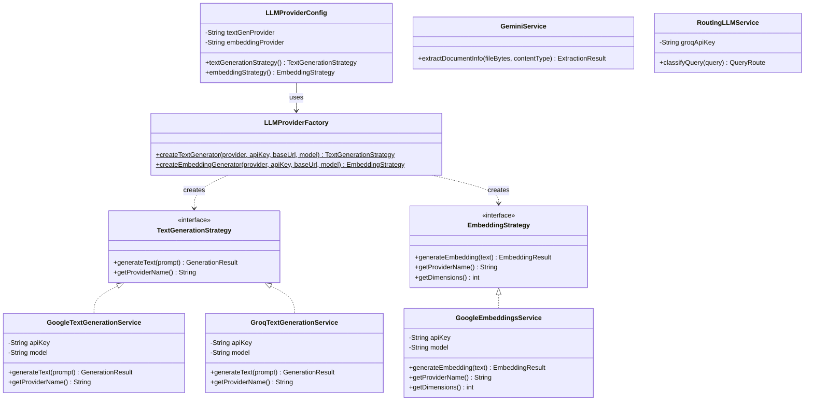

# SmartDocs — AI-Powered Document Intelligence Platform

> Upload documents. Extract knowledge with AI. Ask questions in natural language.

SmartDocs is a **microservices-based backend platform** that uses **Google Gemini AI** to extract structured knowledge from uploaded documents (PDFs, images, text files) and enables **intelligent Q&A** using a **Hybrid RAG pipeline** that combines SQL metadata lookup, Pinecone vector search, and cross-document full-text analysis.

---

## Architecture

```
┌──────────────────────────────────────────────────────────────────────────┐
│                          SMARTDOCS SYSTEM                                │
│                                                                          │
│   ┌──────────────┐    ┌──────────────┐    ┌──────────────┐               │
│   │   Service     │    │     API      │    │    Auth      │               │
│   │  Registry     │    │   Gateway    │    │   Service    │               │
│   │   :8761       │    │    :8080     │    │    :8081     │               │
│   │  (Eureka)     │    │  (Routing)   │    │   (JWT)      │               │
│   └──────────────┘    └──────────────┘    └──────────────┘               │
│                                                                          │
│   ┌──────────────┐    ┌──────────────────────────────────┐               │
│   │  Document     │    │         AI Service               │               │
│   │  Service      │───▶│  • Gemini Vision Extraction      │               │
│   │   :8082       │    │  • Google Embeddings             │               │
│   │  (Upload)     │    │  • Pinecone Vector Store         │               │
│   └──────────────┘    │  • RAG Q&A Pipeline     :8084    │               │
│         │              └──────────────────────────────────┘               │
│         │                                                                │
│   ┌─────▼────────────────────────────────────────────────┐               │
│   │              smartdocs-common (Shared Library)        │               │
│   │  JWT Filter • Entities • RabbitMQ Config • Storage    │               │
│   └──────────────────────────────────────────────────────┘               │
└──────────────────────────────────────────────────────────────────────────┘
```

---

## Tech Stack

| Layer                | Technology                                                  |
| -------------------- | ----------------------------------------------------------- |
| **Language**         | Java 17                                                     |
| **Framework**        | Spring Boot 3.2.4, Spring Cloud 2023.0.1                    |
| **API Gateway**      | Spring Cloud Gateway + Eureka Service Discovery             |
| **Authentication**   | JWT (stateless) with Spring Security                        |
| **Database**         | PostgreSQL (Supabase)                                       |
| **ORM**              | Spring Data JPA / Hibernate                                 |
| **Message Queue**    | RabbitMQ (with Dead Letter Exchange)                        |
| **AI / LLM**         | Google Gemini 2.5 Flash (Vision + Text), Groq Llama 3.3 70B |
| **Embeddings**       | Google gemini-embedding-001 (768 dimensions)                |
| **Vector Store**     | Pinecone                                                    |
| **File Storage**     | Supabase Storage                                            |
| **Build Tool**       | Maven (multi-module parent POM)                             |
| **Containerization** | Docker + Docker Compose                                     |
| **Logging**          | SLF4J + Lombok `@Slf4j`                                     |

---

## Features

- **Document Upload** — PDF, JPEG, PNG, TXT (up to 10MB)
- **AI Extraction** — Multimodal Gemini Vision extracts 3 outputs per document: structured fields (EAV), prose summary, and full text
- **DocumentType Enum** — Standardized 9-category classification (`IDENTITY_DOCUMENT`, `EDUCATION_DOCUMENT`, `FINANCIAL_BILL`, `BANK_STATEMENT`, `SALARY_SLIP`, `LEGAL_DOCUMENT`, `GOVERNMENT_DOCUMENT`, `MEDICAL_DOCUMENT`, `OTHER`) with automatic normalization
- **Strict Field Registry** — Canonical field names per document type ensure consistent SQL metadata across extraction and retrieval
- **Vector Embeddings** — Prose summaries embedded in Pinecone for semantic similarity search
- **Hybrid Query Routing** — Groq Llama 3.3 classifies queries into 3 optimized routes:
  - **FACTUAL** — Instant SQL metadata lookup (zero LLM cost)
  - **SEMANTIC** — Pinecone vector search → LLM answer generation
  - **CROSS_DOCUMENT** — Type-filtered full-text aggregation → LLM analysis
- **User Isolation** — All data scoped per user via `user_email` across PostgreSQL, Pinecone, and Supabase Storage
- **Async Processing** — Upload → AI Extraction → Embedding via RabbitMQ event-driven pipeline
- **Health Checks** — Spring Boot Actuator + custom Pinecone health indicator

---

## Document Processing Pipeline

### System Sequence Diagram

This event-driven pipeline ensures the API remains fast and responsive while heavy AI processing happens asynchronously.



### Processing Flowchart



## Hybrid Query Pipeline

When a user asks a question, a **lightweight router LLM** (Groq Llama 3.1 8B Instant, ~100ms) classifies it and routes to the optimal path:



### Route Comparison

| Route              | When Used                            | Data Source                   | LLM Cost      | Speed |
| ------------------ | ------------------------------------ | ----------------------------- | ------------- | ----- |
| **FACTUAL**        | Single-value lookups (name, ID, DOB) | `document_metadata` SQL table | Free (no LLM) | ~10ms |
| **SEMANTIC**       | Understanding document content       | Pinecone vector search        | 1 LLM call    | ~2-3s |
| **CROSS_DOCUMENT** | Aggregation, comparison across docs  | Full `extracted_text` from DB | 1 LLM call    | ~3-5s |

### DocumentType Enum

All documents are classified into standardized categories for reliable SQL filtering:

| Enum Value            | Covers                                                                  |
| --------------------- | ----------------------------------------------------------------------- |
| `IDENTITY_DOCUMENT`   | Aadhaar, PAN, Passport, Driving License, Voter ID, Ration Card          |
| `EDUCATION_DOCUMENT`  | Marksheet, Degree, Certificate, Transcript, Diploma                     |
| `FINANCIAL_BILL`      | Invoice, Receipt, Bill, Utility Bill, Phone Bill                        |
| `BANK_STATEMENT`      | Bank Statement, Passbook, Account Statement                             |
| `SALARY_SLIP`         | Salary Slip, Pay Stub, Payslip                                          |
| `LEGAL_DOCUMENT`      | Contract, Agreement, Insurance Policy, Rental Agreement, Will, NDA, MOU |
| `GOVERNMENT_DOCUMENT` | Tax Return, ITR, Form 16, Property Tax, Registration Certificate, TDS   |
| `MEDICAL_DOCUMENT`    | Prescription, Lab Report, Discharge Summary, Health Record              |
| `OTHER`               | Anything not recognized                                                 |

### Database Schema (ER Diagram)

The hybrid RAG approach is powered by separating the document text from its strictly typed metadata using an Entity-Attribute-Value (EAV) pattern.



### AI Extensibility (Strategy + Factory Pattern)

The `smartdocs-ai-service` uses the **Strategy** pattern for LLM providers and the **Factory** pattern to instantiate them. This makes it trivial to swap backends based on cost or performance.



---

## Prerequisites

- **Java 17+**
- **Maven 3.8+**
- **Docker & Docker Compose** (for RabbitMQ and optional full-stack deployment)
- **Supabase** account (PostgreSQL + Storage)
- **Google AI API Key** (Gemini — for extraction, text generation, and embeddings)
- **Groq API Key** (for query routing via Llama 3.3)
- **Pinecone** account (vector index: `smartdocs-documents`, 3072 dimensions, cosine metric)

---

## Getting Started

### 1. Clone & Configure

```bash
git clone https://github.com/<your-username>/smartdocs-project.git
cd smartdocs-project
```

Create a `.env` file in the project root:

```env
# Database (Supabase PostgreSQL)
SUPABASE_URL=https://your-project.supabase.co
SUPABASE_DB_URL=jdbc:postgresql://your-supabase-pooler-url:5432/postgres
SUPABASE_DB_USERNAME=postgres.your-project-ref
SUPABASE_DB_PASSWORD=your-password
SUPABASE_SERVICE_KEY=your-supabase-service-key

# JWT
JWT_SECRET_KEY=your-base64-encoded-secret

# AI — Google Gemini (extraction + embeddings + text generation)
GEMINI_API_KEY=your-google-ai-api-key

# AI — Groq (query routing)
GROQ_API_KEY=your-groq-api-key

# Vector Store
PINECONE_API_KEY=your-pinecone-api-key
PINECONE_BASE_URL=https://your-index.svc.pinecone.io
```

### 2. Start Infrastructure & Run (Docker Compose)

The project includes a `docker-compose.yml` that orchestrates all services:

```bash
# Build all modules first
mvn clean install -DskipTests

# Start everything (RabbitMQ + all 5 services)
docker-compose up --build
```

<details>
<summary><strong>Manual startup (without Docker)</strong></summary>

```bash
# Start RabbitMQ
docker run -d -p 5672:5672 -p 15672:15672 rabbitmq:3-management

# Build all modules
mvn clean install -DskipTests

# Start services in order (each in a separate terminal)
cd service-registry && mvn spring-boot:run     # Wait for startup
cd api-gateway && mvn spring-boot:run
cd auth-service && mvn spring-boot:run
cd document-service && mvn spring-boot:run
cd smartdocs-ai-service && mvn spring-boot:run
```

</details>

### 3. Verify

- **Eureka Dashboard:** http://localhost:8761
- **API Gateway:** http://localhost:8080
- **RabbitMQ Management:** http://localhost:15672 (guest/guest)
- **Health Checks:** `http://localhost:<port>/actuator/health` (each service)

---

## API Endpoints

All requests go through the API Gateway at `http://localhost:8080`.

### Authentication

| Method | Endpoint             | Description              | Auth     |
| ------ | -------------------- | ------------------------ | -------- |
| POST   | `/api/auth/register` | Register new user        | Public   |
| POST   | `/api/auth/login`    | Login & get JWT          | Public   |
| GET    | `/api/auth/me`       | Get current user profile | Required |

### Documents

| Method | Endpoint                           | Description             | Auth     |
| ------ | ---------------------------------- | ----------------------- | -------- |
| POST   | `/api/documents`                   | Upload document         | Required |
| GET    | `/api/documents`                   | List user's documents   | Required |
| GET    | `/api/documents/{id}`              | Get document details    | Required |
| GET    | `/api/documents/{id}/download-url` | Get signed download URL | Required |

### AI & Search

| Method | Endpoint                                | Description                    | Auth     |
| ------ | --------------------------------------- | ------------------------------ | -------- |
| GET    | `/api/ai/answers?query=...`             | Ask a question about your docs | Required |
| GET    | `/api/ai/search?query=...&maxResults=5` | Semantic similarity search     | Required |

### Example Usage

```bash
# Register
curl -X POST http://localhost:8080/api/auth/register \
  -H "Content-Type: application/json" \
  -d '{"email":"user@example.com","password":"pass123","firstName":"John","lastName":"Doe"}'

# Login
curl -X POST http://localhost:8080/api/auth/login \
  -H "Content-Type: application/json" \
  -d '{"email":"user@example.com","password":"pass123"}'

# Upload document (use token from login response)
curl -X POST http://localhost:8080/api/documents \
  -H "Authorization: Bearer <your-jwt-token>" \
  -F "file=@document.pdf"

# Ask a question
curl "http://localhost:8080/api/ai/answers?query=what+is+my+PAN+number" \
  -H "Authorization: Bearer <your-jwt-token>"

# Semantic search
curl "http://localhost:8080/api/ai/search?query=marksheet+results&maxResults=3" \
  -H "Authorization: Bearer <your-jwt-token>"
```

---

## Project Structure

```
smartdocs-project/
├── api-gateway/                        # Spring Cloud Gateway — routing, JWT validation
│   ├── filter/
│   │   ├── JwtAuthenticationFilter     # Validates JWT on every routed request
│   │   └── ResponseTimeFilter          # Logs response times for observability
│   └── application.yml                 # Route definitions to downstream services
│
├── service-registry/                   # Netflix Eureka — service discovery (:8761)
│
├── auth-service/                       # User registration, login, JWT issuance (:8081)
│   ├── controller/AuthController       # /auth/register, /auth/login, /auth/me
│   ├── entity/User                     # JPA entity implementing Spring Security UserDetails
│   ├── service/UserService             # BCrypt password encoding, user lookup
│   └── dto/                            # RegisterRequest, LoginRequest, AuthResponse
│
├── document-service/                   # File upload, storage, document management (:8082)
│   ├── controller/DocumentController   # /documents CRUD endpoints
│   ├── service/DocumentService         # Upload to Supabase, save metadata to DB
│   └── service/DocumentProcessingPublisher  # Publishes RabbitMQ messages
│
├── smartdocs-ai-service/               # AI extraction, embeddings, RAG Q&A (:8084)
│   ├── controller/VectorStoreController     # /ai/answers, /ai/search
│   ├── service/
│   │   ├── GeminiService                    # Gemini Vision extraction (multimodal)
│   │   ├── DocumentPipelineService          # RabbitMQ consumer → orchestrates pipeline
│   │   ├── DocumentQnAService               # Hybrid RAG Q&A (FACTUAL/SEMANTIC/CROSS_DOC)
│   │   ├── QueryRouter                      # Routes queries to correct strategy
│   │   ├── RoutingLLMService                # Groq-based query classifier
│   │   ├── GoogleTextGenerationService      # TextGenerationStrategy impl (Gemini)
│   │   ├── GroqTextGenerationService        # TextGenerationStrategy impl (Groq)
│   │   ├── GoogleEmbeddingsService          # EmbeddingStrategy impl (Google)
│   │   └── PineconeVectorStoreService       # Vector upsert/search via Pinecone REST API
│   ├── config/
│   │   ├── LLMProviderFactory               # Static factory for strategy instantiation
│   │   ├── LLMProviderConfig                # Spring @Configuration wiring strategies
│   │   └── PineconeHealthIndicator          # Custom Actuator health check for Pinecone
│   └── service/strategy/
│       ├── TextGenerationStrategy           # Strategy interface for text LLMs
│       └── EmbeddingStrategy                # Strategy interface for embeddings
│
├── smartdocs-common/                   # Shared library (all services depend on this)
│   ├── entity/
│   │   ├── Document                    # JPA entity — documents table
│   │   ├── DocumentMetadata            # JPA entity — document_metadata (EAV)
│   │   └── DocumentType                # Enum with fromGeminiString() normalizer
│   ├── repository/
│   │   ├── DocumentRepository          # Spring Data JPA CRUD + custom queries
│   │   └── DocumentMetadataRepository  # Metadata queries for FACTUAL route
│   ├── security/
│   │   ├── JwtService                  # JWT generation & validation (shared)
│   │   └── JwtAuthenticationFilter     # Servlet filter for downstream services
│   ├── service/SupabaseStorageService  # File upload/download via Supabase REST API
│   ├── config/RabbitMQConfig           # Queue, exchange, DLX declarations
│   ├── dto/ApiResponse                 # Standardized API response wrapper
│   ├── exception/GlobalExceptionHandler
│   └── message/
│       ├── DocumentProcessingMessage   # RabbitMQ message DTO
│       └── EmbeddingGenerationMessage  # RabbitMQ message DTO
│
├── docker-compose.yml                  # Full-stack orchestration (RabbitMQ + 5 services)
├── pom.xml                             # Parent POM (multi-module build)
├── .env                                # Environment variables (gitignored)
└── .gitignore
```

---

## Design Decisions

| Decision                        | Rationale                                                                                                       |
| ------------------------------- | --------------------------------------------------------------------------------------------------------------- |
| **Microservices over Monolith** | Independent scaling of AI workloads vs. auth/upload                                                             |
| **RabbitMQ over direct HTTP**   | Async processing, retry capability, fault tolerance (DLX)                                                       |
| **Eureka Service Discovery**    | Dynamic service registration, load balancing ready                                                              |
| **JWT over Sessions**           | Stateless auth, horizontally scalable across services                                                           |
| **Pinecone over Chroma**        | Cloud-native, no self-hosting, production-grade performance                                                     |
| **Strategy + Factory Pattern**  | `TextGenerationStrategy` / `EmbeddingStrategy` interfaces + `LLMProviderFactory` — swap providers via config    |
| **User isolation via email**    | All queries filter by `user_email` — privacy by design                                                          |
| **DocumentType Enum**           | Standardized classification eliminates free-text mismatch between extraction and routing                        |
| **Strict Field Registry**       | Canonical EAV field names ensure FACTUAL lookups are deterministic and consistent                               |
| **3-Route Hybrid RAG**          | FACTUAL (free/instant), SEMANTIC (deep understanding), CROSS_DOCUMENT (aggregation) — right tool for each job   |
| **Groq for routing**            | Cheap, fast classifier (~100ms, `llama-3.1-8b-instant`) avoids using expensive Gemini for simple classification |
| **EAV over fixed columns**      | `document_metadata` supports any document type without schema changes                                           |
| **spring-dotenv**               | `.env` files loaded automatically by Spring Boot — no manual property source config needed                      |

---

## Future Roadmap

### Smart Context Strategy for CROSS_DOCUMENT

Currently, the CROSS_DOCUMENT route always sends **full extracted text** to the LLM. This is wasteful for structured documents where metadata is sufficient.

**Planned optimization:** Use the `DocumentType` enum to decide context strategy per document:

| DocumentType         | Context Strategy  | Rationale                                                              |
| -------------------- | ----------------- | ---------------------------------------------------------------------- |
| `IDENTITY_DOCUMENT`  | **Metadata only** | Structured, predictable fields (name, DOB, ID) — no need for full text |
| `EDUCATION_DOCUMENT` | **Metadata only** | Marks, roll number, percentage — compact key-value pairs suffice       |
| `SALARY_SLIP`        | **Metadata only** | Salary components are fully captured in metadata                       |
| `FINANCIAL_BILL`     | **Full text**     | Bills vary wildly — metadata can't capture line items reliably         |
| `BANK_STATEMENT`     | **Full text**     | Transaction-level detail only exists in full text                      |

This would **reduce token usage by 80%+** for queries like _"Is my name same on Aadhaar and PAN?"_ by sending ~20 fields instead of 2 full pages of text.

### Other Planned Improvements

- **Conversation Memory** — Multi-turn Q&A with context from previous questions
- **Document Expiry Alerts** — Notify users when identity documents (passport, DL) are approaching expiry using `expiry_date` metadata
- **Frontend Dashboard** — React/Next.js UI with document cards, metadata tables, and spending charts powered by SQL metadata
- **Batch Upload** — Upload and process multiple documents in a single request
- **LLM Zero-Retention Policy** — All document processing utilizes enterprise API endpoints (Google Gemini/Groq) with explicit zero-data-retention agreements, ensuring sensitive identity information (Aadhaar, PAN, etc.) is **never** used to train foundation models or retained by third-party LLM providers.

---

## License

This project is for educational and portfolio purposes.
